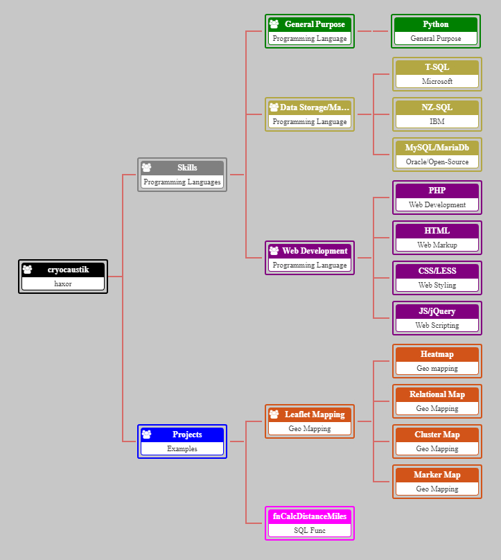

# Org Chart
An interactive html organization chart that can use external data to load and plot relations.

## Dependencies
- [OrgChart - core js/css library for this chart](https://github.com/dabeng/OrgChart)
- [Font Awesome - an awesome collection of icons](http://fontawesome.io)
- [jsPDF - to allow exporting the chart in PDF form](https://github.com/MrRio/jsPDF)
- [jQuery v3.2.1](https://code.jquery.com)
- [LESS - CSS Preprocessor that simplifies child styling](http://lesscss.org)


## Interactive Demo
[Live Demo (rawgit)](https://cdn.rawgit.com/cryocaustik/OrgChart/master/index.html)

## Examples



## Code examples
### html place holder
```html
<head>
    <title>Org Chart from CSV</title>

    <link rel="stylesheet" href="./css/font-awesome.min.css">
    <link rel="stylesheet" href="./css/jquery.orgchart.min.css">
    <link rel="stylesheet" type="text/css" href="./css/style.css">

    <script src="./js/jquery.min.js"></script>
    <script src="./js/jquery.orgchart.min.js"></script>
    <script src="./js/jspdf.min.js"></script>
</head>

<body>
    <div id="chart-container"></div>
    <script>
        // js chart code here
    </script>
</body>
```

### Importing data and creating chart object
```js
var json_url = './data/data.json';
var orgData = NaN;
$.ajax({
    'async': false,
    'url': json_url,
    'dataType': 'json',
    'success': function(data) {
        orgData = data;
    }
});

$(function() {
    var oc = $('#chart-container').orgchart({
        'data': orgData,
        'nodeContent': 'title',
        'exportButton': true,
        'exportFileextension': 'pdf',
        'direction': 'l2r',
        'pan': true,
        'zoom': true
    });

    oc.$chartContainer.on('touchmove', function(event) {
        event.preventDefault();
    });

});
```